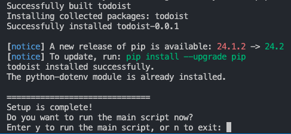
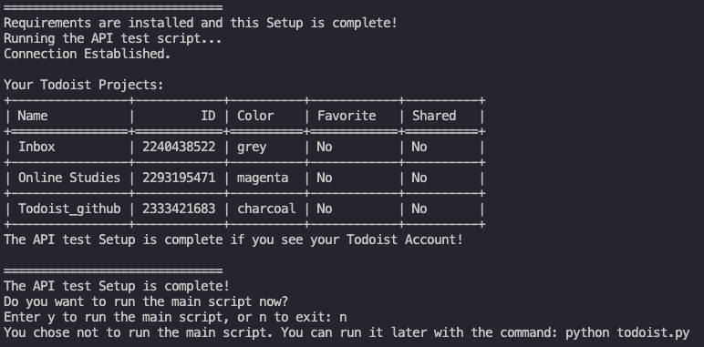
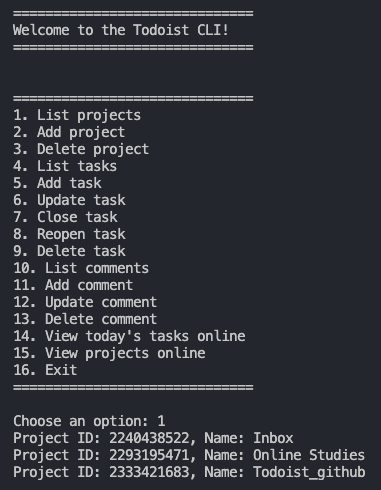

&nbsp;

<p align="center">
  
</p>

<h1 align="center">Hi, Welcome to Todoist CLI! </h1>

<p align="center" style="font-size: 16px;">
  <br>
  <i style="font-size: 14px;">
    Hey, I'm Ranger and I have updated and tested on 29th July 2024.The Script has been testing on Macbook Pro M3 using Python version 3.11.8. This is now a fully working operating deathstar.<br><br>
  </i>
</p>

<p align="center">
</p>

<p align="center">
  
</p>
 
<div align="center">
<a href="https://github.com/davidtkeane" target="_blank">

</a>
<a href="https://twitter.com/davidtkeane" target="_blank">

</a>
<a href="https://linkedin.com/in/sami-hindi-b31435248/" target="_blank">

</a>
</div>

<br>
<p align="center">
  
  
  
</p>
<br>
<p align="center">
  
  
</p>

## 🧐 About


<br>
<br>
<p style="text-align: center;">
<a href="https://todoist.com/">Sign up for a Todoist account</a>
</p>
 <p>
        Todoist is a powerful task management app that helps you organize your life. With Todoist, you can create tasks and projects, set due dates and priorities, and even assign tasks to others. Todoist syncs across all your devices, so you can manage your tasks wherever you are. It also integrates with many other apps and services, including Gmail, Google Calendar, Slack, Amazon Alexa, and more. Whether you're managing a team, writing an epic screenplay, or just making a grocery list, Todoist is there to help you achieve more every day.
</p>

<br>
<br>

The Todoist CLI is a Python script that interacts with the Todoist API to provide a command-line interface for managing your Todoist tasks.

The script uses the `todoist-python` package to interact with the Todoist API and the `python-dotenv` package to load environment variables from a .env file. The environment variable `TODOIST_API_KEY` is used to authenticate with the Todoist API.

When you run the script, it displays a menu of options for managing your Todoist tasks. You can list, add, update, close, reopen, and delete tasks. You can also manage projects and comments. In addition, you can open the Todoist web app to view today's tasks and your active projects.

Here's how it works:

1. The script loads your Todoist API key from a .env file using `python-dotenv`.
2. It creates a `TodoistAPI` object using your API key.
3. It displays a menu of options and asks you to choose an option.
4. Depending on your choice, it calls a function to perform the chosen operation. For example, if you choose to list tasks, it calls the `get_tasks` method on the `TodoistAPI` object and then prints the tasks.
5. If an operation requires user input, such as adding a task, it prompts you to enter the necessary information.
6. After performing an operation, it goes back to step 3, unless you choose to exit the script.

This script provides a quick and easy way to manage your Todoist tasks from your terminal. It's especially useful if you prefer using the command line over a graphical user interface, or if you want to automate your task management with scripts.

<br>
<br>

## Idea

I had an idea if I could connect Todoist to my original todo_list program I made (Not uploaded yet) for Powershell, the Powershell todo_list was finished, and I thought if I could connect my todo_list to Todoist. This script does not do that, this script is to let you control your Todoist from the terminal or command line. This script lets you do most things available with this code. I copied and pasted all the code from the Todoist API guide, and with the help of GitHUb CoPilot we arrived at this script. Please enjoy and upgrade and own it.

<br>
<br>

 
## Help and Install Files Explained. More detailed instructions can be found below. Lots and lots! 

1. (todoist.py) This is the main file to run to get the todoist working in the terminal. It wont work right away as you need to install the requirements and also to get you Todoist API Key. It's Free!! If you are reading this first, then follow the steps below.  
```bash
python todoist.py
```
2. (install.py) Install the todoist script with one command. The script will ask you questions, make files for the script to work. 
```bash
python install.py
```
3. (requirements.txt) This file is for installing modules that make the script work. If you want to install manually then use this command
```bash
pip install -r requirements.txt
```
4. (todoist_api_test.py) This will test you Todoist API Key without running the main script.
   Just add your API key to the .env file TODOIST_API_KEY="Putyourkeyinhere"
```bash
python todoist_api_test.py
```
5. (usr-bin.sh) To be able to use todoist from the command line instead of having to goto the directory then type python todoist.py. The script will enable you to just type todoist in the terminal and the script will run. This script will copy todoist.py and send a copy to /usr/local/bin/todoist. This works on Macbook (Currently testing Windows and Linux). There is a slight modification to the todoist.py file which is saved in the help_files folder, and help on Windows and Linux is also located in the folder help_files/todoist_install_help.md.
```bash
bash usr-bin.sh
```
6. (/help_files/todoist.py) This version of todoist.py is for sending into the /usr/local/bin/ folder so you can run todoist on the command line. This file will be used for usr-bin.sh.

<br>
<br>

## 🚀 Quick Installation Guide. More Detailed Guide Below.

1. git clone https://github.com/davidtkeane/todoist-cli-python-api.git
2. cd todoist-cli-python-api/help_files.
3. The install.py file is inside the Help_files folder.
4. The requirements.txt file is inside the Help_files folder.
5. Extra Help to install Todoist file is inside the Help_files folder. File name is todoist_install_help.md
6. Get your API key. It's free. [Click here to get your Todoist API Key](https://app.todoist.com/app/today)
7. Add API Key into the .env file 'TODOIST_API_KEY=YourKey'.
8. Then test the API key with the file todoist_api_test.py which is inside the Help_files folder.
   ```
   python todoist_api_test.py

   ```
9. After everything is installed you can start the script by this comand.
   ```python
   python todoist.py
   ```

## 🥷 Where to get the Todoist API key.

1. Login with a new account or old account.
2. Then go to today [Todoist Website](https://app.todoist.com/app/today) for the API Key.
3. Click your profile name and settings.
4. Click Integrations.
5. Click Developer.
6. Copy API Token.
7. Add to API Key when the install.py asks for it. The .env file will be created if the file is not there.

## 💻 Developer API Documentation

1. Developing with Todoist [website](https://developer.todoist.com/guides/#developing-with-todoist)
2. Todoist REST API. This is the link this script uses  `https://developer.todoist.com/rest/v2/#overview`
3. When in the Todoist settings, you will find the REST API which is the https: link above to communicate over the internet.

## 🚀 Now we are ready to Install and launch

1. Clone this repository to your local machine.
   ```
    git clone https://github.com/davidtkeane/todoist-cli-python-api.git
   ```
2. First. Click here for the [Todoist Website](https://app.todoist.com/app/today) and get your API Key, then Copy the Key.
3. The Menu has instructions on how to find the API key shown below.
   ```
   1. Login with a new account or old account.
   2. Then go to today https://app.todoist.com/app/today
   3. Click your profile name and settings.
   4. Click Integrations
   5. Click Developer
   6. Copy API Token
   7. Add to .env file
   ```
4. Run the install.py file. This will tell you if you have the modules needed installed.
5. You only need to run install_todoist.py once per install. 
   ```
   python install.py
   ```
6. You will get this menu.
   
7. The script will ask you for the Todoist API key in the terminal, then that is sent into the .env file for you.
8. It shows you that The following modules are required:
9. If the modules are installed it will say, if not it will ask you to install them.


8. If the modules are not installed, it will asked you to install The todoist module is not installed.
   Do you want to install todoist? This module is safe and used by millions. (y/n)

   * Press y for yes.
   * 

     9. The script will then run the todoist_api_test.py file to establish if you are able to connect to Todo

   
9. Press y for yes run the script.

   The Normal way to run the app after the install will be

   ```
   python todoist.py
   ```

   

## 📖 Usage

To use the `todoist.py` script, you can run the following command in PowerShell or Linux/Mac terminal:

```powershell
Run the script from your terminal with the following command:

python todoist.py
```

## 📚 Available Commands in Program

==============================

1. List projects
2. Add project
3. Delete project
4. List tasks
5. Add task
6. Update task
7. Close task
8. Reopen task
9. Delete task
10. List comments
11. Add comment
12. Update comment
13. Delete comment
14. View today's tasks online
15. View projects online
16. Exit

## 🛠️ Functions

## 🤝 Contributing

Contributions are welcome! Please feel free to submit a Pull Request.

## 📜 License

This project is licensed under the MIT License.

## 📞 Contact

If you have any questions, feel free to reach out to me at rangersmyth.74@gmail.com

[](https://github.com/FujiwaraChoki)
